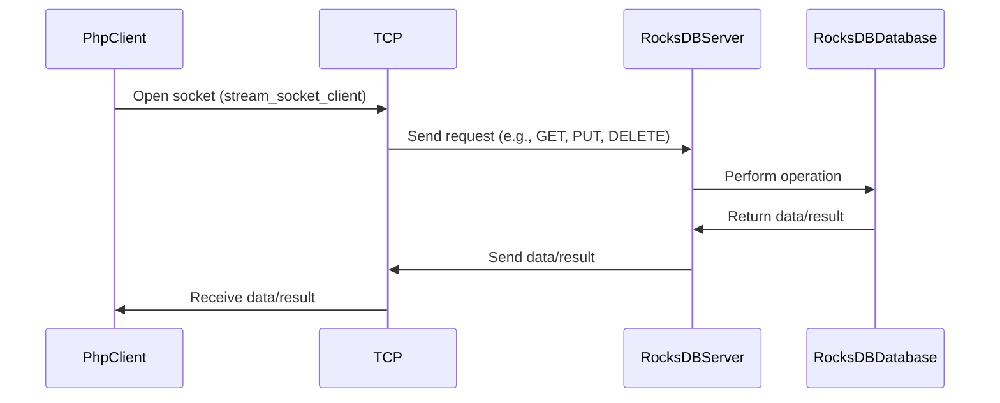

[](https://packagist.org/packages/s00d/rocksdb-client-php)
[](https://packagist.org/packages/s00d/rocksdb-client-php)
[](https://github.com/s00d/rocksdb-client-php/blob/master/LICENSE)
[](https://github.com/s00d/rocksdb-client-php)

# RocksDB Client PHP

A PHP client for interacting with RocksDB server.

## Overview

This package is a part of the [RocksDBFusion](https://github.com/s00d/RocksDBFusion) project. Before integrating this client into your application, you need to run the RocksDB server provided by RocksDBFusion.

## Installation

You can install the package via Composer:

```bash
composer require s00d/rocksdb-client-php
```

## Workflow
Below is the diagram illustrating how the client interacts with the RocksDB server:



## Configuration

### Laravel Integration

1. **Add the service provider**:

   In your `config/app.php` file, add the service provider to the `providers` array:

   ```php
   'providers' => [
       // Other Service Providers

       s00d\RocksDB\RocksDBServiceProvider::class,
   ],
   ```

   And the alias to the `aliases` array:

   ```php
   'aliases' => [
       // Other Facades

       'RocksDB' => s00d\RocksDB\Facades\RocksDB::class,
   ],
   ```

2. **Publish the configuration file**:

   ```bash
   php artisan vendor:publish --provider="s00d\RocksDB\RocksDBServiceProvider"
   ```

   This will create a `config/rocksdb.php` configuration file where you can set the connection details.

3. **Update your `.env` file**:

   Add your RocksDB connection details to the `.env` file:

   ```env
   ROCKSDB_HOST=127.0.0.1
   ROCKSDB_PORT=6379
   ROCKSDB_TOKEN=null
   ```

4. **Usage**:

   Now you can use the RocksDB client in your Laravel application:

   ```php
   use RocksDB;

   // Put a value
   RocksDB::put('key', 'value');

   // Get a value
   $value = RocksDB::get('key');

   // Delete a key
   RocksDB::delete('key');

   // Other available methods...
   ```

### Direct Usage (Without Laravel)

If you want to use the client without Laravel, you can directly instantiate the `RocksDBClient` class.

1. **Create an instance**:

   ```php
   use s00d\RocksDB\RocksDBClient;

   $client = new RocksDBClient('127.0.0.1', 6379);

   // If you have a token
   // $client = new RocksDBClient('127.0.0.1', 6379, 'your-token');
   ```

2. **Usage**:

   ```php
   // Put a value
   $client->put('key', 'value');

   // Get a value
   $value = $client->get('key');

   // Delete a key
   $client->delete('key');

   // Other available methods...
   ```

## Server Setup

This package is a client for the RocksDB server, which is part of the [RocksDBFusion](https://github.com/s00d/RocksDBFusion) project. Before using this client, ensure the RocksDB server is running. You can set up and run the server by following the instructions in the [RocksDBFusion](https://github.com/s00d/RocksDBFusion) repository.

## Workflow

Below is the diagram illustrating how the client interacts with the RocksDB server:


## Methods

### put

Stores a key-value pair in the database.

```php
RocksDB::put('key', 'value', 'optional_column_family');
```

### get

Retrieves the value of a key from the database.

```php
$value = RocksDB::get('key', 'optional_column_family', 'default_value');
```

### delete

Deletes a key from the database.

```php
RocksDB::delete('key', 'optional_column_family');
```

### merge

Merges a value with an existing key.

```php
RocksDB::merge('key', 'value', 'optional_column_family');
```

### listColumnFamilies

Lists all column families in the database.

```php
$columnFamilies = RocksDB::listColumnFamilies('path_to_db');
```

### createColumnFamily

Creates a new column family.

```php
RocksDB::createColumnFamily('new_column_family');
```

### dropColumnFamily

Drops an existing column family.

```php
RocksDB::dropColumnFamily('column_family');
```

### compactRange

Compacts the database within a range.

```php
RocksDB::compactRange('start_key', 'end_key', 'optional_column_family');
```

### Transactions

#### Begin Transaction

Begins a new transaction.

```php
$txnId = RocksDB::beginTransaction();
```

#### Commit Transaction

Commits a transaction.

```php
RocksDB::commitTransaction($txnId);
```

#### Rollback Transaction

Rolls back a transaction.

```php
RocksDB::rollbackTransaction($txnId);
```

## License

This project is licensed under the MIT License - see the [LICENSE](https://github.com/s00d/rocksdb-client-php/blob/master/LICENSE) file for details.

## Links

- [GitHub Repository](https://github.com/s00d/rocksdb-client-php)
- [Packagist Package](https://packagist.org/packages/s00d/rocksdb-client-php)
- [RocksDBFusion](https://github.com/s00d/RocksDBFusion)
